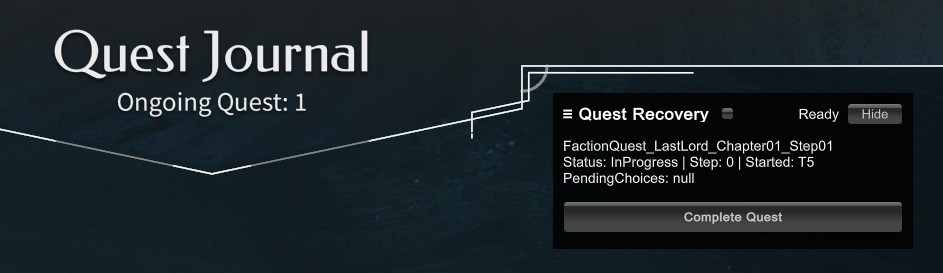

# Quest Recovery (Endless Legend 2)

Quest Recovery is a small **single-player recovery mod** for *Endless Legend 2*.

It provides a simple in-game button that lets you **mark a stuck major faction quest step as completed**, allowing the quest chain to continue when a quest becomes blocked or fails to progress correctly during early access.

This mod is designed to **unblock stuck quests**, not to automate gameplay or replace normal progression.

---

## What this mod does

- Marks the **current major faction quest step** as completed so the quest chain can continue
- Uses the game’s internal quest progression logic
- Requires an explicit, in-game click (no automatic actions)

**Limitations:**
- ❌ No automation or bulk quest skipping
- ❌ No save-file editing
- ❌ Disabled in multiplayer (SP-only; no actions available)

---



---

## Installation

### 1. Install BepInEx
1. Download **BepInEx 5.x (Windows x64)**  
   https://github.com/BepInEx/BepInEx/releases

   BepInEx is a commonly used mod loader for Unity games. It does not modify game files and can be removed at any time.

2. Extract it into your *Endless Legend 2* install directory
3. Launch the game once to generate the `BepInEx` folders

The game directory will typically be located at:
```
C:\Program Files (x86)\Steam\steamapps\common\ENDLESS Legend 2\
```

---

### 2. Install Quest Recovery
1. Download `QuestRecovery_v1.0.0.zip`
   https://github.com/AdBergman/EL2Mods/releases/tag/v1.0.0
2. Extract the contents into the *same directory that contains* `ENDLESS Legend 2.exe`  
   (so that `BepInEx/plugins/QuestRecovery/EL2.QuestRecovery.dll` exists)
3. Launch the game

---

## Usage

1. Open the **Quest** window in-game
2. A small **Quest Recovery** panel will appear
3. If a recoverable quest step is detected, click **Skip Quest**
4. The action is applied once and then locked until the quest state updates

If the quest UI does not update immediately, end the turn or perform any action that triggers a game refresh.

---

## Uninstall

Delete the `QuestRecovery` folder from: 
```
BepInEx/plugins/
```

---

## Notes

This is a recovery tool for edge cases.  
Always keep backups of important saves when using mods.

---

## License

MIT License. See the root `LICENSE` file for details.
